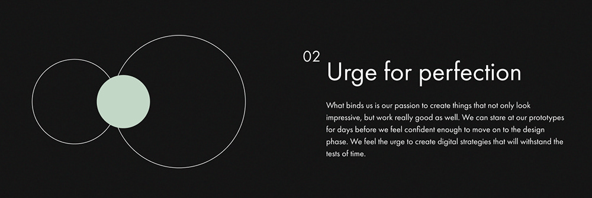
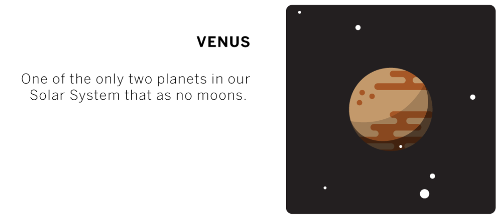

# Good news, everyone!

Вы попали в репозиторий с заданиями от **[Accenture](https://www.accenture.com/ru-ru)**. Задания собраны в блоки. Блок по гиту нужно выполнить первым, блоки и задания в блоках по вёрстке и javascript можно проходить в любом порядке. Важно выполнить как можно больше основных заданий. _Дополнительные_ - не обязательны к выполнению, не беритесь за них, если не располагаете достаточным временем. Но если очень хочется, то можно.

## Вашими заданиями, если вы возьметесь за их выполнение, будут...

___

### Практика git/github

В этом блоке вам предстоит поработать с гитом и гитхабом. Порядок работы следующий (не пугайтесь):

- сделайте форк текущего репозитория (мастер-репозитория). Форк - это копия чужого репозитория в вашем хранилище репозиториев (аккаунте);
- склонируйте локально репозиторий с гитхаба;
- создайте ветку с названием `вашаФамилия.вашеИмя`, например, **`pushkin.alexander`**;
- в этой ветке создайте файл под задачу, выполните её, сделайте коммит и запушьте изменения в свой репозиторий;
- зайдите на github, откройте пулл-реквест из вашего репозитория в мастер-репозиторий;
- все следующие задания продолжайте делать в текущей ветке, новые изменения после коммита просто пушьте в свой репозиторий, пулл-реквест больше открывать не нужно - они попадут в открытый;
- пулл-реквест закрывать не нужно - он будет влит, когда будут выполнены все задания или перед защитой.

Что поможет вам на этом этапе:

- [Введение в системы контроля версий](https://htmlacademy.ru/blog/boost/tools/version-control-system)
- [Словарь терминов для Git и GitHub](https://htmlacademy.ru/blog/boost/tools/git-and-github-glossary)
- [Работа с Git через консоль](https://htmlacademy.ru/blog/boost/frontend/git-console)
- [Полезные команды для работы с Git](https://htmlacademy.ru/blog/boost/tools/useful-commands-for-working-with-git)
- [Регистрация на Гитхабе. Работа через GitHub Desktop](https://htmlacademy.ru/blog/boost/tools/register-on-github-work-with-github-desktop) (Это опционально, если вы захотите работать с github через приложение, а не консоль)
- [Как работать с GitHub в большой команде](https://htmlacademy.ru/blog/boost/tools/github-in-academy)

Консольные команды для работы с гитом можно посмотреть [здесь](git-commands.md) или [здесь](https://htmlacademy.ru/blog/boost/frontend/first-aid-git). Вам нужны далеко не все.

___

### Практика вёрстки

Во всех заданиях:

- шрифт может быть любым, проще всего использовать встроенные системные, вроде Arial, Times New Roman, Courier New, Georgia и тп. Убедитесь, что ваш шрифт поддерживается на Mac, Windows и Linux. Если вы используете шрифт, который специфичен для конкретной платформы, на другой он будет заменён другим шрифтом, и ваша вёрстка будет выглядеть иначе;

- для вёрстки каждого задания можно создавать отдельный html-документ или работать в одном. В последнем случае важно, чтобы между элементами документа были отступы, элементы не наслаивались друг на друга. Один html-документ можно назвать просто `index.html`, если же их будет несколько, давайте файлам понятные названия. Помещайте файлы в папку `solutions/`;

- создавая html-документ, не забывайте про doctype и ключевые теги: html, head, body. Если вы используете vscode или другой редактор кода, в котором установлен плагин emmet, можете пользоваться [шорткатом `!`](https://dwstroy.ru/stail/plaginy-rasshireniya/emmet-shpargalka/);

- там, где текста много, можно использовать "рыбу" - набор слов, вроде [Lorem Ipsum](https://ru.lipsum.com/) (такой же текст можно создать в редакторе с помощью emmet).

##### Задания:

1. Задание-разминка: сверстать фигуру, подобную той, что на фото. Текст может быть любым уместным. Одно слово обязательно должно быть выделено, как на фото. Линии должны проходить точно по центру кружка, а текст в кружке должен быть отцентрован по осям координат.

    >_**Дополнительно**: добавить эффект при наведении (hover + transition) на кружок на свой вкус: изменение цвета, смещение текста, смещение линий с текстом и тп_

2. Задание посложнее: сверстать карточку с геометрическими фигурами и текстом. Нужно расположить фигуры и текст максимально похоже, как на фото. Размеры фигур и текста могут отличаться от макета, размер карточки в целом может быть больше или меньше, но желательно хотя бы приблизительно соблюсти пропорции. Проще говоря: максимально повторить в масштабе или без. Цвета можно подобрать с помощью инструмента **_пипетка_** (есть во многих редакторах и просмотрщиках графики), можно указать свой. Все окружности должны находиться на одной линии, проходящей через их центры.

3. Ещё сложнее: нужно сверстать несколько (2-5) геометрических фигур, как на макете. Фигурой может быть и паттерн, вроде палочек или пунктирной линии (одинокий квадрат или плюс в зачёт не пойдут).
В этом задании нужно использовать **минимальное** количество html-тегов и минимальное количество css-свойств. Проще говоря: избегайте копирования, подключайте смекалку.

    >_**Дополнительно**: добавить постоянную (keyframe) анимацию на свой вкус, например, элементы фигуры могут переливаться цветами или смещаться относительно друг друга и тп._

4. Не останавливаемся: нужно сверстать карточку планеты. С текстом проблем не должно возникнуть, а планету нужно именно нарисовать на css. Звёзды (белые кружки) можно расположить по-своему. Планета должна быть в центре квадрата, у неё должны быть тени, у полосочек - скругления, как на изображении: наружные и внутренние. Так же старайтесь избавляться от копирования там, где от него можно избавиться.

    >_**Дополнительно**: добавить анимацию мигания звёзд или вращения планеты со смещением линий, смещения тени, падения метеорита или что сейчас модно ._

Все изображения можно найти в папке `img/` данного репозитория. Для удобства вёрстки можно воспользоваться расширением pixel perfect для браузера или просто подложить его фоном, задав opacity около 0.3, и просто верстать поверх.

Что поможет вам на этом этапе:

- [Основы CSS](https://htmlacademy.ru/courses/307)
- [Оформление текста](https://htmlacademy.ru/courses/309)
- [Селекторы. Знакомство](https://htmlacademy.ru/courses/42)
- [Наследование и каскадирование](https://htmlacademy.ru/courses/66)
- [Селекторы. Погружение](https://htmlacademy.ru/courses/57)
- [Блочная модель документа](https://htmlacademy.ru/courses/44)
- [Флексбокс. Знакомство](https://htmlacademy.ru/courses/96)
- [Позиционирование](https://htmlacademy.ru/courses/45)
- [Двумерные трансформации](https://htmlacademy.ru/courses/71)
- [Игра теней](https://htmlacademy.ru/courses/51)
- [Мастерская: декоративные элементы](https://htmlacademy.ru/courses/55)
- [Мастерская: декоративные эффекты](https://htmlacademy.ru/courses/76)

Для дополнительных заданий:

- [Плавные переходы](https://htmlacademy.ru/courses/84)
- [Анимация](https://htmlacademy.ru/courses/80)

Проходите те курсы, которые нужны вам в данный момент для выполнения задания.

___

### Практика JavaScript

Для выполнения этих заданий вам нужно создать аккаунт на [codewars](https://www.codewars.com/). Каждое задание будет необходимо выполнять на сайте, на проверку присылать только решение. Для чего так? Для того, чтобы вы познакомились и привыкли к интерфейсу сайта codewars, и в последствии, возможно, использовали его для практики программирования. А ещё чтобы увидели, как можно было решить эту задачу иначе.

В процессе решения задачи ваш код будет автоматически тестироваться. Тесты запускаются кнопкой TEST или хоткеем `ctrl + s`. Кнопка ATTEMPT прогоняет больше тестов, и если все они прошли - появляется кнопка SUBMIT. Это значит, функция написана правильно, потому что она решает задачу. Вот в этот момент и нужно скопировать своё решение в файл в репозитории и отправить на проверку.

После того, как вы засабмитите своё решение на codewars, вам будут показаны решения других пользователей. Вовсе не обязательно копировать в свой репозиторий самое популярное решение с сайта, вполне достаточно будет своего, работающего, потому что важно, чтобы оно решало задачу, а как - пока не важно.

Для заданий создавайте или отдельные файлы, или один - на ваш выбор. В одном файле отделяйте функции друг от друга пустыми строками, файл назовите `index.js`. В комментарии к функции пишите, к какому заданию она относится.
Если файлов будет много, давайте понятные названия каждому: достаточно будет номера задания (пример - `1.1.js` или `1-1.js`, `1-iii.js`).

##### Задания:

1. Простые задания:

    1. [Quarter of the year](https://www.codewars.com/kata/5ce9c1000bab0b001134f5af)
    2. [Cat years, Dog years](https://www.codewars.com/kata/5a6663e9fd56cb5ab800008b)
    3. [Grasshopper - If/else syntax debug](https://www.codewars.com/kata/57089707fe2d01529f00024a)

2. Посложнее:

    1. [Highest and Lowest](https://www.codewars.com/kata/554b4ac871d6813a03000035)
    2. [Find the Squares](https://www.codewars.com/kata/60908bc1d5811f0025474291)
    3. [Strange mathematics](https://www.codewars.com/kata/604517d65b464d000d51381f)

3. Если скучно:

    1. [Format a string of names like 'Bart, Lisa & Maggie'.](https://www.codewars.com/kata/53368a47e38700bd8300030d)
    2. [Break camelCase](https://www.codewars.com/kata/5208f99aee097e6552000148)
    3. [If you can read this...](https://www.codewars.com/kata/586538146b56991861000293)

Что поможет вам на этом этапе:

- [Основы программирования на JavaScript](https://htmlacademy.ru/courses/207)
- [Условия](https://htmlacademy.ru/courses/209)
- [Циклы](https://htmlacademy.ru/courses/211)
- [Массивы](https://htmlacademy.ru/courses/213)
- [Функции](https://htmlacademy.ru/courses/215)
- [Объекты](https://htmlacademy.ru/courses/217)

___

Мы не сможем работать с вами в синхронном формате: вы задали вопрос - мы тут же на него ответили. Практикой занимается небольшая команда работающих специалистов, смотреть работы и отвечать на вопросы мы сможем только асинхронно: вы задали вопрос, мы ответили, когда появилась возможность.
Если у вас возник вопрос или затруднение, вы можете:

- открыть ишью (issue) [на гитхабе](https://github.com/DSTU-frontend-practice-2021/Group-2/issues),
- отправить начатое решение задания на гитхаб. В открытом пулл-реквесте под теми строками, которые вызывают вопросы (не работают или работают не так), вы можете оставить комментарии с вопросами.

В обоих случаях **постарайтесь задать вопрос так, чтобы на него можно было ответить, не задавая уточняющих вопросов**. Например, как это советуют [здесь](https://habr.com/ru/post/460221/) или [здесь](https://tproger.ru/explain/xyproblem/). В вопросе, заданном в ишью приложите, скриншоты (не всего экрана, а части, в windows 10 это делает сочетание клавиш `win + shift + s`, например) или примеры кода, который не работает. Задав вопрос, продолжайте ресёрч или переходите к следующему заданию, если нет понимания, как решить проблему.

**Обязательно просматривайте** открытые пулл-реквесты и ишью ваших коллег по группе: делайте ревью, пишите советы по коду, советуйте статьи, которые помогли вам. Если время позволяет, можете просматривать и соседние группы. Ошибки, загвоздки будут примерно одинаковыми у всех, возможно, так вы найдёте решение для себя. **Не критикуйте - помогайте, советуйте**, почитайте, как сделать хорошее ревью, [здесь](https://tproger.ru/articles/kod-revju-kak-sdelat-pravilno/).

Старайтесь пушить каждый день. Закончили на сегодня работу, не планируете вернуться - коммит + пуш, планируете ещё работать, но через 4-6 часов - доведите до осмысленного состояния, закомментируйте спорные участки, чтобы их не ревьюили, затем коммит + пуш. Так как ревью кода асинхронное, вы не знаете, когда ваш код будет проверен, поэтому имеет смысл поддерживать репозиторий в актуальном состоянии.

Успешного прохождения практики! И помните: задания боятся вас не меньше, чем вы боитесь их.

